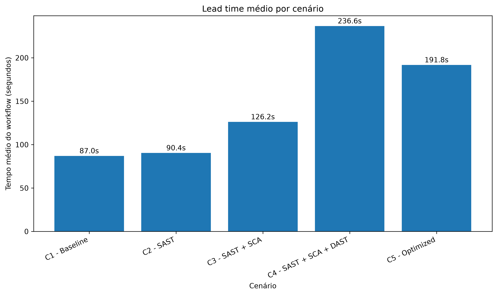
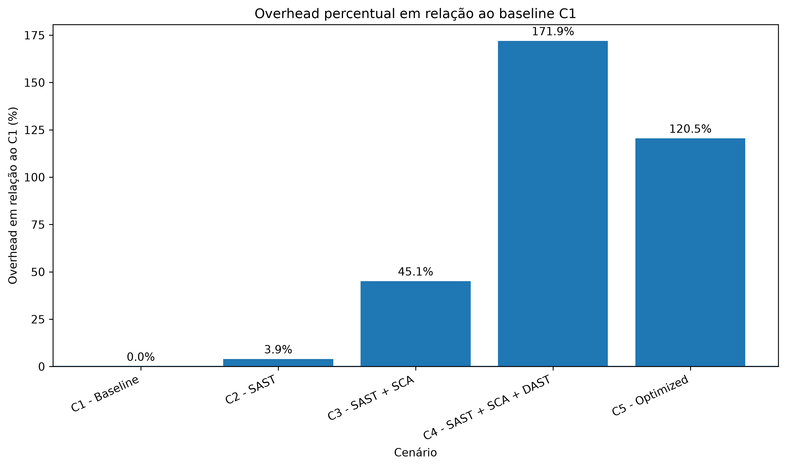
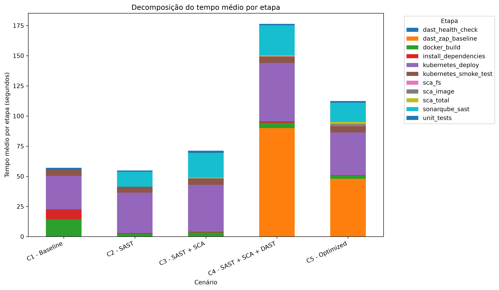
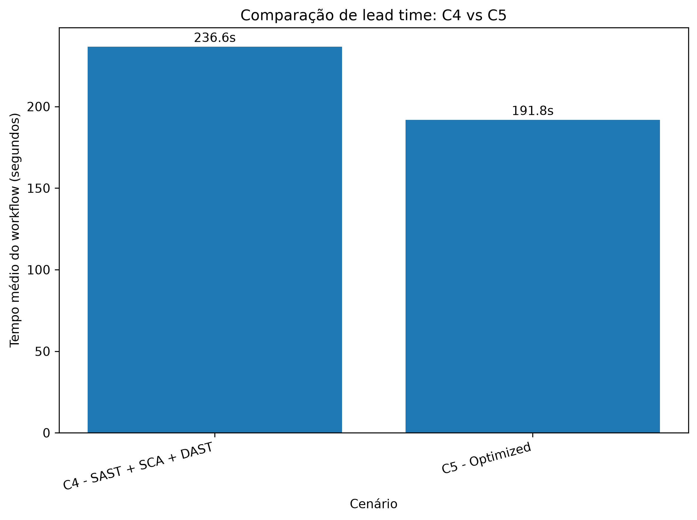

# Resultados e Discussão

## Sumário

- [1. Visão geral dos cenários analisados](#1-visão-geral-dos-cenários-analisados)
- [2. Metodologia de análise](#2-metodologia-de-análise)
- [3. Estatísticas descritivas do lead time](#3-estatísticas-descritivas-do-lead-time)
- [4. Impacto incremental das práticas de segurança](#4-impacto-incremental-das-práticas-de-segurança)
- [5. Overhead em relação ao baseline](#5-overhead-em-relação-ao-baseline)
- [6. Análise por etapa do pipeline](#6-análise-por-etapa-do-pipeline)
- [7. Comparação entre C4 e C5](#7-comparação-entre-c4-e-c5)
- [8. Principais achados](#8-principais-achados)
- [9. Limitações da análise](#9-limitações-da-análise)
- [10. Arquivos gerados](#10-arquivos-gerados)
- [11. Conclusão parcial](#11-conclusão-parcial)

Este documento corresponde à **Etapa 11 — Análise e gráficos** do TCC *Avaliação Experimental do Impacto de Práticas DevSecOps no Lead Time de Pipelines CI/CD*. Seu objetivo é transformar os dados experimentais coletados nas etapas anteriores em tabelas, gráficos e interpretação acadêmica, respondendo à pergunta central da etapa: **qual foi o impacto de cada prática DevSecOps no lead time do pipeline CI/CD?**

A análise apresentada utiliza **estatística descritiva**[^estatistica-descritiva]. Não foram aplicados testes inferenciais, de modo que os resultados devem ser interpretados como evidência experimental descritiva no contexto deste trabalho.

## 1. Visão geral dos cenários analisados

O experimento avaliou cinco cenários de pipeline CI/CD, construídos de forma **progressiva**: cada cenário adiciona uma camada de prática de segurança ao anterior, até chegar ao cenário otimizado. essa progressão permite comparar, de forma controlada, a variação de tempo observada após a introdução de cada prática ou ferramenta.

| Cenário | Descrição                                                          |
| ------- | ------------------------------------------------------------------ |
| C1      | Pipeline baseline sem ferramentas de segurança                     |
| C2      | Pipeline com SAST usando SonarQube                                 |
| C3      | Pipeline com SAST + SCA usando SonarQube e Trivy                   |
| C4      | Pipeline com SAST + SCA + DAST usando SonarQube, Trivy e OWASP ZAP |
| C5      | Pipeline otimizado                                                 |

O cenário **C1 é o baseline** do estudo, ou seja, o ponto de referência sem qualquer ferramenta de análise de segurança. A partir dele, os demais cenários medem o impacto incremental de cada prática: **C2 mede o impacto do SAST**, **C3 mede o impacto adicional do SCA**, **C4 mede o impacto adicional do DAST** e **C5 mede o impacto das otimizações** aplicadas sobre o pipeline completo.

## 2. Metodologia de análise

A análise foi conduzida a partir do dataset `analysis/processed/results_normalized.csv`, que consolida as medições normalizadas das execuções do pipeline. Os procedimentos adotados foram:

- foram consideradas apenas execuções válidas;
- todas as execuções analisadas estavam com status `success`;
- foram utilizadas **5 execuções por cenário**;
- a métrica principal de lead time foi `workflow_total`[^workflow-total];
- as etapas operacionais do pipeline foram analisadas separadamente da métrica total;
- `workflow_total` foi **excluído** do ranking de etapas operacionais.

A escolha de `workflow_total` como métrica principal se justifica por ela representar o tempo total de uma execução completa do workflow CI/CD, que é exatamente o conceito de lead time investigado neste TCC. As etapas operacionais (como build, deploy e execução de cada ferramenta) foram tratadas em uma análise distinta, para evitar a confusão entre o tempo total do workflow e o tempo de uma atividade individual.

> [!IMPORTANT]
> A métrica `workflow_total` representa o tempo total do workflow e foi usada como principal métrica de lead time. Ela não deve ser tratada como uma etapa operacional individual do pipeline.

## 3. Estatísticas descritivas do lead time

A tabela a seguir apresenta as estatísticas descritivas de `workflow_total` para cada cenário, considerando as 5 execuções válidas de cada um.

| Cenário                | Execuções | Média (s) | Mediana (s) | Mínimo (s) | Máximo (s) | Desvio padrão (s) |
| ---------------------- | --------: | --------: | ----------: | ---------: | ---------: | ----------------: |
| C1 - Baseline          |         5 |      87,0 |        87,0 |         80 |         93 |              5,61 |
| C2 - SAST              |         5 |      90,4 |        88,0 |         79 |        108 |             10,69 |
| C3 - SAST + SCA        |         5 |     126,2 |       127,0 |        107 |        149 |             16,02 |
| C4 - SAST + SCA + DAST |         5 |     236,6 |       207,0 |        197 |        309 |             49,67 |
| C5 - Optimized         |         5 |     191,8 |       180,0 |        172 |        240 |             27,63 |

A interpretação dos valores médios deve ser feita com cautela, dado o tamanho reduzido da amostra[^amostra-pequena]:

- **C1** apresentou média de **87,0 s**, servindo de referência para os demais cenários;
- **C2** ficou próximo de C1 (90,4 s), sugerindo baixo impacto médio do SAST sobre o tempo total;
- **C3** apresentou aumento perceptível da média (126,2 s) após a adição do SCA;
- **C4** registrou a **maior média** entre todos os cenários (236,6 s), acompanhada do maior desvio padrão (49,67 s);
- **C5** reduziu a média em relação ao C4 (191,8 s), embora tenha permanecido acima do baseline.

O **desvio padrão elevado em C4** indica maior variação entre as execuções desse cenário, o que será discutido nas seções seguintes ao se examinar a etapa de DAST.

## 4. Impacto incremental das práticas de segurança

O impacto incremental compara cada cenário com o cenário imediatamente anterior, isolando o efeito da prática adicionada. A tabela apresenta o overhead absoluto e o overhead percentual[^overhead-percentual] de cada comparação.

| Comparação | Interpretação           | Média referência (s) | Média cenário (s) | Overhead absoluto (s) | Overhead percentual |
| ---------- | ----------------------- | -------------------: | ----------------: | --------------------: | ------------------: |
| C2 - C1    | Impacto do SAST         |                 87,0 |              90,4 |                   3,4 |               3,91% |
| C3 - C2    | Impacto do SCA          |                 90,4 |             126,2 |                  35,8 |              39,60% |
| C4 - C3    | Impacto do DAST         |                126,2 |             236,6 |                 110,4 |              87,48% |
| C5 - C4    | Impacto das otimizações |                236,6 |             191,8 |                 -44,8 |             -18,93% |

A leitura de cada comparação é a seguinte:

- **C2 - C1** mede o impacto do SAST, com aumento médio de apenas 3,4 s (3,91%);
- **C3 - C2** mede o impacto do SCA, com aumento médio de 35,8 s (39,60%);
- **C4 - C3** mede o impacto do DAST, com aumento médio de 110,4 s (87,48%);
- **C5 - C4** mede o impacto das otimizações, com **redução** média de 44,8 s (-18,93%).

Nestas medições, o **DAST foi a prática com maior impacto incremental sobre o lead time**, contribuindo com um aumento médio de **110,4 s (87,48%)** em relação ao cenário anterior. Em sentido oposto, o conjunto de otimizações aplicado em C5 reduziu o tempo médio em **44,8 s (-18,93%)** em relação a C4.

## 5. Overhead em relação ao baseline

Enquanto a seção anterior comparou cenários consecutivos, esta seção compara cada cenário diretamente com o baseline C1, evidenciando o custo temporal acumulado de cada configuração.

| Cenário                | Média (s) | Overhead absoluto vs C1 (s) | Overhead percentual vs C1 |
| ---------------------- | --------: | --------------------------: | ------------------------: |
| C1 - Baseline          |      87,0 |                         0,0 |                     0,00% |
| C2 - SAST              |      90,4 |                         3,4 |                     3,91% |
| C3 - SAST + SCA        |     126,2 |                        39,2 |                    45,06% |
| C4 - SAST + SCA + DAST |     236,6 |                       149,6 |                   171,95% |
| C5 - Optimized         |     191,8 |                       104,8 |                   120,46% |

Em relação ao baseline, os valores observados foram:

- **C2:** 3,91% acima de C1;
- **C3:** 45,06% acima de C1;
- **C4:** 171,95% acima de C1;
- **C5:** 120,46% acima de C1.

Os dados indicam que **C5 reduziu o overhead acumulado em relação a C4** (de 171,95% para 120,46%), o que é coerente com o efeito das otimizações. Ainda assim, **C5 permaneceu acima do baseline C1**, ou seja, as otimizações reduziram parte do custo temporal, mas não o eliminaram.

## 6. Análise por etapa do pipeline

Esta seção examina as etapas operacionais do pipeline de forma agregada entre os cenários, com o objetivo de identificar quais atividades concentram maior tempo. O ranking abaixo ordena as etapas pela média de tempo medido.

| Etapa                 | Execuções | Média (s) | Mediana (s) | Mínimo (s) | Máximo (s) | Desvio padrão (s) |
| --------------------- | --------: | --------: | ----------: | ---------: | ---------: | ----------------: |
| dast_zap_baseline     |        10 |     69,00 |        58,0 |         36 |        197 |             47,35 |
| kubernetes_deploy     |        25 |     36,80 |        34,0 |         27 |         75 |             10,17 |
| sonarqube_sast        |        20 |     18,35 |        15,5 |         10 |         34 |              7,99 |
| docker_build          |        25 |      5,40 |         3,0 |          2 |         17 |              4,86 |
| kubernetes_smoke_test |        25 |      5,08 |         5,0 |          5 |          6 |              0,28 |

A interpretação do ranking é a seguinte:

- `dast_zap_baseline` foi a **etapa operacional mais demorada**, com média de 69,00 s e o maior desvio padrão (47,35 s), o que é consistente com a variação observada em C4;
- `kubernetes_deploy` teve **contribuição relevante**, com média de 36,80 s;
- `sonarqube_sast` apresentou impacto **intermediário**, com média de 18,35 s;
- as etapas associadas ao SCA tiveram **baixo tempo médio** nestas medições, não figurando entre as mais custosas;
- `workflow_total` **não aparece** nesta análise, pois foi corretamente excluído do ranking de etapas operacionais.

> [!WARNING]
> A métrica `workflow_total` não foi incluída no ranking de etapas operacionais, pois não representa uma atividade individual do pipeline. O tempo total do workflow não deve ser misturado nem comparado diretamente com o tempo de uma etapa específica.

## 7. Comparação entre C4 e C5

A comparação direta entre o cenário completo (C4) e o cenário otimizado (C5) permite avaliar o resultado das otimizações aplicadas.

Os principais valores comparados são:

- **C4** teve média de **236,6 s**;
- **C5** teve média de **191,8 s**;
- **redução absoluta:** 44,8 s;
- **redução percentual:** 18,93%;
- **C5 também reduziu o desvio padrão** em relação a C4 (de 49,67 s para 27,63 s).

A redução simultânea da média e do desvio padrão sugere que as otimizações tornaram o cenário C5 não apenas mais rápido, em média, como também mais **estável** entre execuções. Esse resultado indica **melhora**, mas **não a eliminação** do overhead introduzido pelas práticas de segurança.

## 8. Principais achados

Considerando o caráter descritivo da análise e o tamanho reduzido da amostra, os principais achados são apresentados de forma cautelosa:

- o **SAST teve baixo impacto médio** sobre o lead time em relação ao baseline (3,91%);
- o **SCA aumentou o tempo médio** do pipeline (overhead incremental de 39,60%);
- o **DAST foi o principal fator de aumento do lead time**, com o maior impacto incremental observado (110,4 s ou 87,48%);
- o cenário **C5 reduziu o tempo médio em relação ao C4** (-44,8 s ou -18,93%);
- mesmo otimizado, **C5 permaneceu acima do baseline C1** (120,46% de overhead vs. C1);
- a **variação em C4 foi maior** que nos demais cenários, associada principalmente ao tempo da etapa `dast_zap_baseline`.

Esses achados descrevem associações observadas no ambiente experimental e **não devem ser tratados como relações de causalidade absoluta** nem generalizados para outros contextos.

## 9. Limitações da análise

A interpretação dos resultados deve considerar as seguintes limitações metodológicas:

- foram realizadas apenas **5 execuções por cenário**, o que limita conclusões estatísticas mais fortes;
- o experimento foi conduzido em um **ambiente local e controlado**, com runner self-hosted;
- a análise utilizou apenas **estatística descritiva**, sem testes inferenciais;
- pode haver influência de fatores como **cache frio ou quente** entre execuções;
- há **variação operacional** inerente à execução de pipelines CI/CD;
- os resultados **não devem ser generalizados** para todos os pipelines DevSecOps.

> [!NOTE]
> Como cada cenário possui apenas 5 execuções, os resultados devem ser interpretados como evidência experimental descritiva no contexto deste TCC, e não como medidas definitivas ou universais.

## 10. Arquivos gerados

A análise produziu o notebook, os gráficos e as tabelas listados a seguir.

| Tipo     | Arquivo                                               |
| -------- | ----------------------------------------------------- |
| Notebook | `analysis/notebooks/results_analysis.ipynb`           |
| Gráfico  | `analysis/charts/lead_time_by_scenario.png`           |
| Gráfico  | `analysis/charts/stage_time_breakdown.png`            |
| Gráfico  | `analysis/charts/overhead_percentage_by_scenario.png` |
| Gráfico  | `analysis/charts/c4_vs_c5_optimization.png`           |
| Tabela   | `analysis/tables/scenario_statistics.csv`             |
| Tabela   | `analysis/tables/incremental_overhead.csv`            |
| Tabela   | `analysis/tables/baseline_overhead.csv`               |
| Tabela   | `analysis/tables/stage_statistics_by_scenario.csv`    |
| Tabela   | `analysis/tables/stage_ranking.csv`                   |

## 11. Conclusão parcial

Os resultados desta etapa indicam que a **integração progressiva de práticas DevSecOps aumentou o lead time** do pipeline CI/CD em relação ao baseline. Entre as práticas avaliadas, o **DAST foi o maior responsável pelo aumento do tempo total**, apresentando o maior impacto incremental e a maior variação entre execuções.

O **cenário otimizado (C5) reduziu parte do overhead** em relação ao C4, tanto na média quanto na dispersão dos tempos, evidenciando que ajustes no pipeline podem mitigar o custo das verificações de segurança. Ainda assim, **mesmo otimizado, o pipeline manteve custo temporal acima do baseline C1**.

No conjunto, os resultados sustentam a necessidade de **equilibrar segurança e eficiência** em pipelines CI/CD, reforçando que a adoção de práticas DevSecOps introduz verificações de segurança a um custo temporal que pode — e deve — ser gerenciado por meio de otimizações. Tais conclusões valem para o ambiente experimental deste trabalho e não devem ser generalizadas sem novos estudos.

[^workflow-total]: Neste trabalho, `workflow_total` representa o tempo total medido para uma execução completa do workflow CI/CD, sendo adotado como a principal medida de lead time.

[^overhead-percentual]: O overhead percentual expressa a variação relativa do tempo médio de um cenário em comparação com uma referência (o cenário anterior ou o baseline), calculado como a razão entre o overhead absoluto e a média de referência, multiplicada por 100.

[^estatistica-descritiva]: A estatística descritiva resume e organiza os dados observados (por meio de medidas como média, mediana, valores mínimo e máximo e desvio padrão), sem realizar inferências ou generalizações para além da amostra coletada.

[^amostra-pequena]: A amostra pequena (5 execuções por cenário) reduz a robustez das conclusões estatísticas e aumenta a sensibilidade dos resultados a variações pontuais, motivo pelo qual as interpretações deste documento são apresentadas de forma cautelosa.